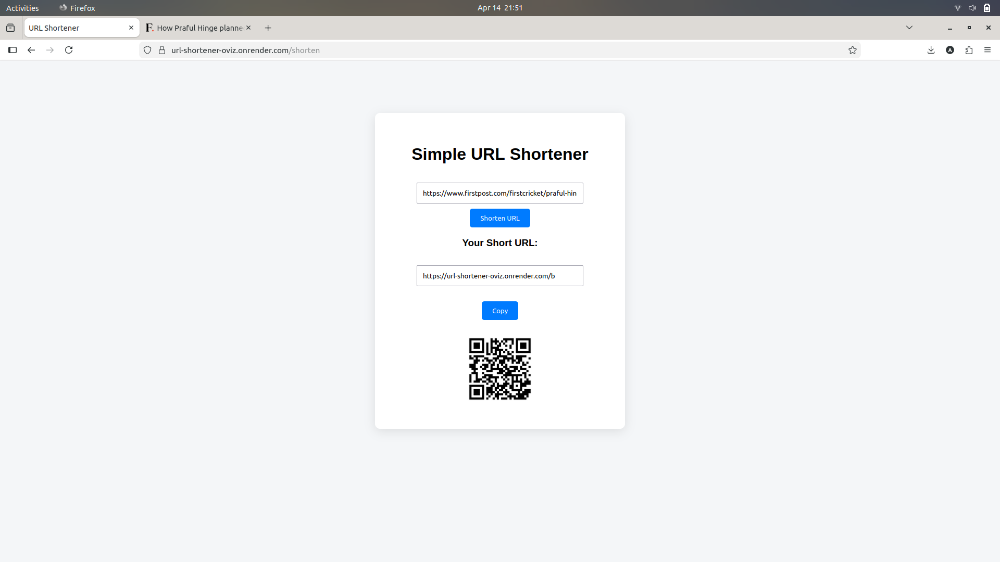

# 🔗 URL Shortener

A web application that converts long URLs into short, shareable links.

## Features
- Base62 encoding for deterministic short URL generation
- Automatic redirection
- QR code generation
- SQLite database storage

## Tech Stack
Python, Flask, SQLite, HTML, CSS, JavaScript

## Demo
Live: https://url-shortener-oviz.onrender.com

## Screenshot

## Installation
git clone https://github.com/abhiiishek-codes/url-shortener.git
cd url-shortener
pip install -r requirements.txt
python3 app.py